 

<h2 align="center">Обо мне</h2>

<table>
<tr>
<td width="62%" valign="middle">

Привет! Я **Семён**, full-stack разработчик. Делаю сайты и веб-приложения, которые приводят бизнесу заявки, а не просто красиво выглядят.

Беру задачу целиком: от структуры и вёрстки до формы, которая отправляет заявки в Telegram, на почту или в CRM.

- Сайты и лендинги под ключ
- SPA и личные кабинеты на Vue 3
- Вёрстка по макетам Figma
- CRM, боты и автоматизация
- Деплой, настройка сервера и доменов
- Доработка и ускорение существующих сайтов

</td>
<td width="38%" align="center" valign="middle">

</td>
</tr>
</table>

 

<h2 align="center">Технологии</h2>

**Frontend**

**Backend и базы данных**

**Деплой и сервер**

 

Настраиваю деплой под ключ: Nginx, SSL-сертификаты, домены, SMTP-почта и базовая защита сервера (UFW и др.). 
Работаю в основном с PostgreSQL, при необходимости быстро разбираюсь с другими базами и инструментами.

 

<h2 align="center">Проекты</h2>

| Проект | Что сделано | Стек | Демо |
|:--|:--|:--|:--:|
| **[Магазин кроссовок](https://github.com/kiberwitch/VueTailwind)** | Корзина, избранное, сортировка | Vue 3 · Pinia · Tailwind | [открыть](https://kiberwitch.github.io/VueTailwind/) |
| **[Petalia](https://github.com/kiberwitch/Petalia-flower-shop)** | Лендинг цветочного магазина | Vue · Tailwind | [открыть](https://kiberwitch.github.io/Petalia-flower-shop/) |
| **[Сайт юриста](https://github.com/kiberwitch/Site_business_ard_lawyer_Michelson)** | Продающий сайт-визитка | HTML · CSS · JS | — |
| **[Vitaliti](https://github.com/kiberwitch/Vitaliti_Website)** | Доработка сайта, форма заявки | HTML · CSS · JS · PHP | [открыть](https://kiberwitch.github.io/Vitaliti_Website/) |
| **[Лендинг на Vue](https://github.com/kiberwitch/Vue-Tailwind)** | Масштабируемый лендинг | Vue · Tailwind | [открыть](https://kiberwitch.github.io/Vue-Tailwind/) |
| **[Книжный магазин](https://github.com/kiberwitch/Book_store)** | Каталог с корзиной | HTML · CSS · JS | [открыть](https://kiberwitch.github.io/Book_store/) |

 

**Есть задача? Напишите на Kwork, предложу решение, сроки и стоимость.**

